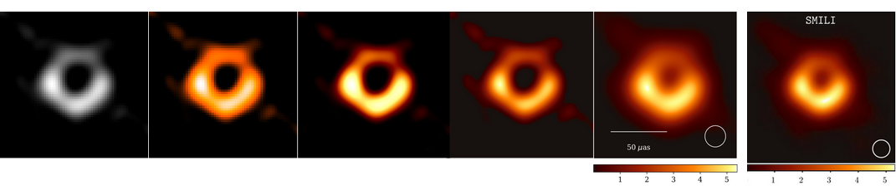

# SMILI Pipeline Guide

<p align = "center">
  
</p>

***Progress of reproducing the black hole image with SMILI library (with comparison to SMILI image from Paper IV)***
<br>
<br>

The SMILI pipeline is one of three pipelines (along with DIFMAP & EHT-Imaging) used to produce the first image of a black hole in M87. This project aims to provide findings about the reproducibility process of reconstructing an image of a black hole using SMILI's software. The ```smili``` repository contains the python scripts and its outputs (tested using a virtual machine with 64-bit Ubuntu 18.04). The ```post-processing``` respository contains further edits needed to better resemble the image as shown in Paper IV.

*NOTE*: SMILI uses an older version of astropy, but the newest version of astropy is needed for some post-processing steps. Consider looking into this if running into errors in these parts.

### Relative Links
* [SMILI Github Repository](https://github.com/astrosmili/smili)
* [SMILI Installation Guide](https://smili.readthedocs.io/en/latest/install.html)
* [EHT Github Repository and Data](https://github.com/eventhorizontelescope)

### Documentation
* [Setting up the Environment](https://github.com/TauferLab/Src_EHT/blob/main/SMILI/documentation/Part-1.md)
* [SMILI, External Libraries, and Dependencies](https://github.com/TauferLab/Src_EHT/blob/main/SMILI/documentation/Part-2.md)
* [Ds9, ehtim, & ehtplot](https://github.com/TauferLab/Src_EHT/blob/main/SMILI/documentation/Part-3.md)
* [Executing SMILI Pipeline](https://github.com/TauferLab/Src_EHT/blob/main/SMILI/documentation/Part-4.md)
* [Post Processing](https://github.com/TauferLab/Src_EHT/blob/main/SMILI/documentation/Part-5.md)


## Acknowledgement 
Special thanks to the Event Horizon Telescope collaboration and SMILI development team for allowing the public to have access to the M87 data and pipeline code. This project was possible with the mentorship of University of Tennessee's [GCLabs](https://globalcomputing.group/research.html). I highly suggest anyone interested in astronomy (or even the STEM field) to try this out as it's quite rewarding in many aspects.
